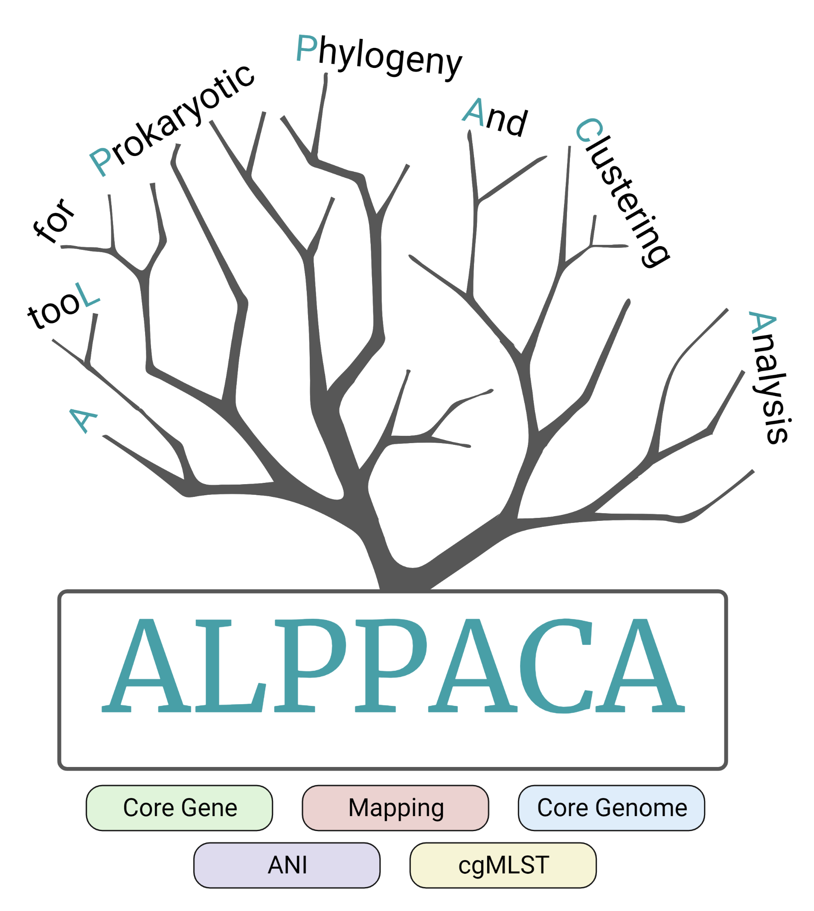

Logo generated with www.biorender.com

# Information
ALPPACA is a pipeline for various phylogenetic analyses of prokaryotic isolates. 
The pipeline includes core genome-, core gene-, and reference-based (mapping) phylogeny, as well as FastANI and cgMLST (under development). 
Please see the [description](https://github.com/NorwegianVeterinaryInstitute/ALPPACA/wiki/1.-Pipeline-and-program-descriptions) page for more information.

# Installation and Running
Please check the [wiki](https://github.com/NorwegianVeterinaryInstitute/ALPPACA/wiki).
- [Installation](https://github.com/NorwegianVeterinaryInstitute/ALPPACA/wiki/2.-Installation)
- [How to run](https://github.com/NorwegianVeterinaryInstitute/ALPPACA/wiki/3.-Input-and-usage)
- [Output file descriptions](https://github.com/NorwegianVeterinaryInstitute/ALPPACA/wiki/5.-Output-files)

# Citation
ALPPACA has been published in Journal of Open Source Software. Use the following citation:

Kaspersen et al., (2022). ALPPACA - A tooL for Prokaryotic Phylogeny And Clustering Analysis. Journal of Open Source Software, 7(79), 4677, https://doi.org/10.21105/joss.04677
