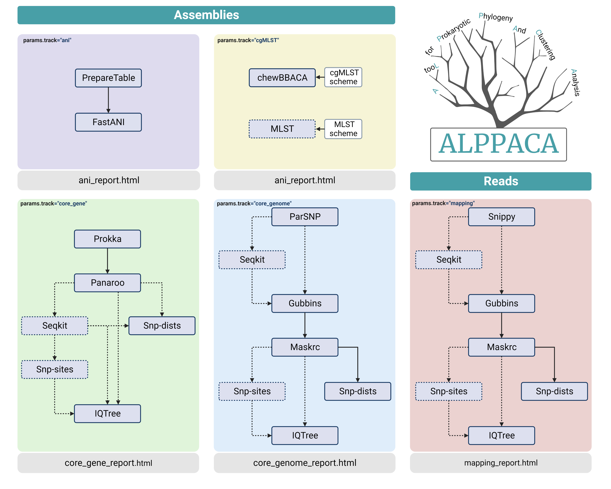

# Summary
Phylogenetic analysis is often a complex and time-consuming process. We developed A tooL for Prokaryotic Phylogeny And Clustering Analysis (ALPPACA), a pipeline designed for phylogenetic analysis of prokaryotes. The pipeline is implemented in Nextflow and utilize singularity containers, which makes the pipeline portable and reproducible. The pipeline consists of three different tracks designed to cover three different levels of expected dataset diversity, facilitating the choice of performing appropriate analysis for different datasets. The final results are presented in a tidy HTML report for each track. The code and documentation is publicly available on Github.

# Statement of need
Unraveling the evolutionary relationship between organisms is a crucial part of many comparative genomics projects. However, the complexity of preparing, running, and interpreting such analyses is a hindrance for many researchers not specialized in evolutionary biology. Additionally, choosing a combination of compatible software for various analysis scenarios may be difficult. Here we present A tooL for Prokaryotic Phylogeny And Clustering Analysis (ALPPACA), a Nextflow [@DiTommaso:2017] pipeline for phylogenetic analysis of prokaryotic genomes. The pipeline has been developed to make it easier to run phylogenetic analysis and provides reports to simplify result interpretation. Our pipeline is composed of three main tracks, designed to allow analysis of datasets represented by three different genetic diversity levels. These levels of similarity influence what assumptions are used to consider sequences as orthologous when reconstructing the multiple alignment required for phylogenetic inference. For instance, our pipeline can be run on datasets with an expected low- (eg. outbreak situation), medium- (eg. within a single MLST cluster), or high diversity level (eg. across ST or for closely related species). One major advantage of this pipeline is the possibility for the user to select tracks based on their data at hand, which makes it possible to generate analysis results in a rapid fashion.

# Pipeline and track descriptions
## Pipeline
ALPPACA is a nextflow pipeline hosted on github (https://github.com/NorwegianVeterinaryInstitute/ALPPACA). The pipeline utilize singularity containers for running the various tools, which can be easily downloaded by using the setup shell script included in the repository. These images ensures that the user runs the correct versions of the tools, and makes the pipeline portable and reproducible. All images, except the R image, are verified and hosted by galaxyproject.org. The R image is curated by the authors and hosted at [sylabs.io](https://sylabs.io/singularity/). The pipeline has been tested on datasets of various sizes and species to ensure proper memory and CPU requirements for different dataset sizes. However, the user may change these settings to reflect their own system requirements and dataset sizes.

## Tracks
The pipeline consists of three separate tracks depending on the objectives and data available to the user (\autoref{fig:figure1}).
First, the core gene track is designed to be used for datasets that are expected to have a relatively high level of genetic diversity. It takes assemblies as input, and starts by running annotations with Prokka [@Seemann:2014]. Then, a pangenome analysis is run with Panaroo [@Tonkin-Hill:2020]. After the pangenome analysis, different optional paths can be taken, such as deduplication with Seqkit [@Shen:2016] and removal of constant sites with snp-sites [@Page:2016]. Removing constant sites is an option that decreases the computational load for larger datasets, in such cases our pipeline automatically provide the frequency of constant sites required to IQTREE, ensuring that analyses will be run with the proper options. SNP distances are calculated from either the deduplicated alignment or full alignment using snp-dists (https://github.com/tseemann/snp-dists). Lastly, the phylogenetic tree is reconstructed with IQTree [@Nguyen:2015]. The user has an option for automatic model testing in IQTree or to supply a specific evolutionary model.

The second track, core genome, is designed to be used for datasets with a medium or low level of genetic diversity. 
It takes assemblies as input and runs ParSNP [@Treangen:2014] to generate a core genome alignment. Similar to the core gene track, a deduplication step is optional after generating the alignment. Then, Gubbins [@Croucher:2015] is run to identify recombinant areas which are subsequently masked with maskrc-svg (https://github.com/kwongj/maskrc-svg). The masking of recombinant areas is done to ensure that solely the genetic material from vertical descent is included in the analysis. SNP-distances are calculated from the masked alignment with snp-dists. An optional step of removing constant sites is included, before reconstructing the phylogenetic tree with IQTree.

Lastly, the third track, mapping, is designed to be used for datasets with an expected low genetic diversity, or if comparing to a specific reference genome is of interest. This track takes reads as input, and maps these to a reference genome provided by the user and reconstruct the multiple-genome alignment with Snippy (https://github.com/tseemann/snippy). Then, it follows the same workflow as the core genome track described above.

# Conclusion
The ALPPACA pipeline offers a user-friendly way of running phylogenetic analysis on different datasets. The pipeline is reproducible and flexible, and only requires a few options and parameters to run. The Nextflow framework allows for easy development and additions to the pipeline in the future.

# Acknowledgements
The projects QREC-MaP (Research Funding for Agriculture and the Food Industry, Norwegian Research Council, project number 255383), KLEB-GAP (Trond Mohn Foundation, project number TMS2019TMT03), and Yersiniosis at Sea (Norwegian Seafood Research Fund grant, project number 901505) are acknowledged for providing the research platform for this work. The computations were performed on resources provided by UNINETT Sigma2 - the National Infrastructure for High Performance Computing and Data Storage in Norway.

# References
